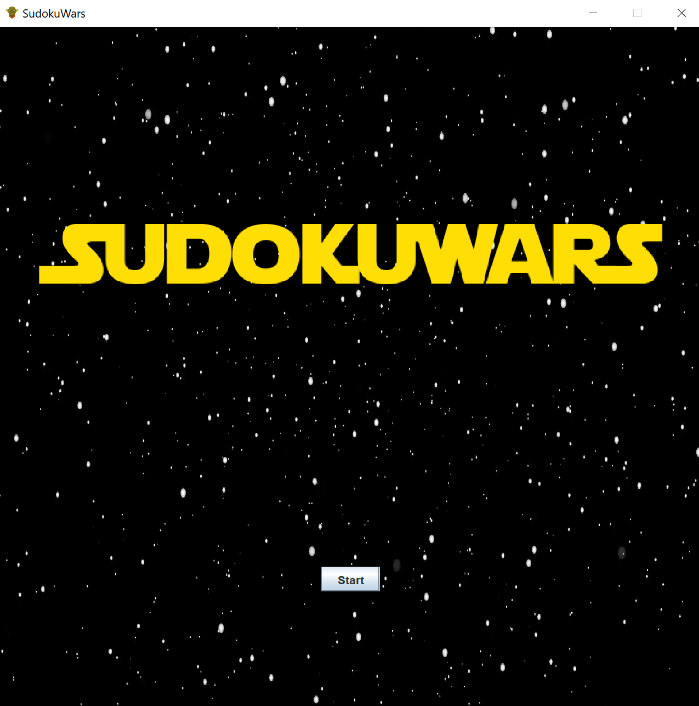
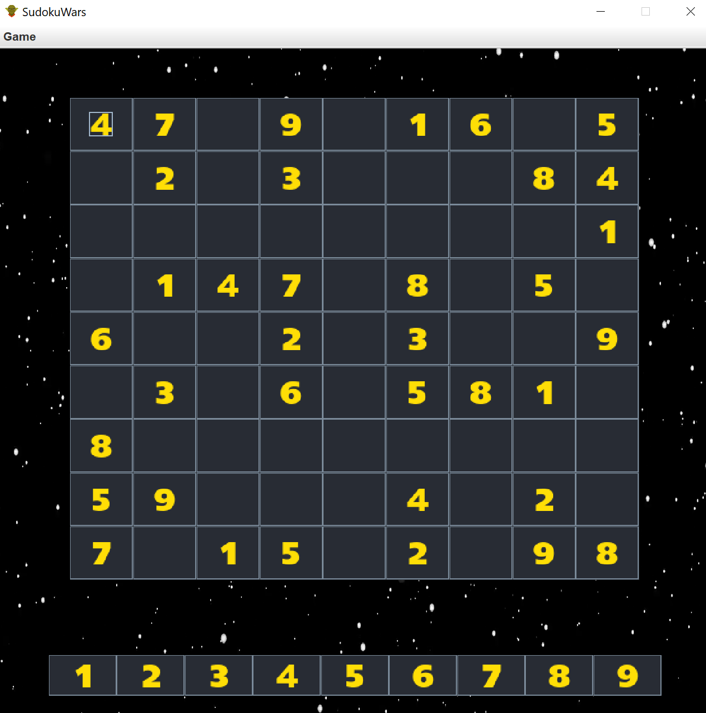

# SudokuWars

Star Wars themed Sudoku Game programmed in Java with the Swing library

---

## Introduction

This application is being developed for our Honors: Intro to Computer Science II
class. CSCI 1260.

---

## Images




---

## Instructions

To compile and run SudokuWars, run the following commands:

``` bash
javac -d bin src/sudoku/*.java
java -cp bin sudoku.SudokuDriver
```

---

## Credits

We would like to acknowledge the various resources we used throughout the
development of this project.

### Audio

- Star Wars Sound Effects on [soundboard.com](https://www.soundboard.com/sb/starwarsfx)
- Sounds from the Star Wars Movies on [The Sound Archive](https://www.thesoundarchive.com/star-wars.asp)

### Visuals

- [WallpaperAccess](https://wallpaperaccess.com/star-wars)
- [Wallpaper Flare](https://www.wallpaperflare.com/search?wallpaper=star+wars)
- [Font Generator](https://www.dafont.com/star-jedi.font)
- [Icons](https://icons8.com/icons/set/star-wars)

---

## Contributors

- *Holden Dalton* - daltonh@etsu.edu
- *Shay Snyder* - snyderse2@etsu.edu
- *Hannah Taylor* - taylorhm1@mail.etsu.edu

---

## Misc

- [Design Document](https://etsu365-my.sharepoint.com/:w:/g/personal/snyderse2_etsu_edu/Edj9tO5yJx9IjJqxE3u1ux0BfrArykc4PO5uTZMFryiEbA?e=5Teonb)
- [Presentation](https://etsu365-my.sharepoint.com/:p:/g/personal/snyderse2_etsu_edu/EY_pIK3EcA9It5g8qNIrj2QB4PYpDzgOitWbk0zjkW3v6w?e=ZDB6tm)
